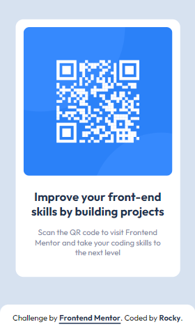
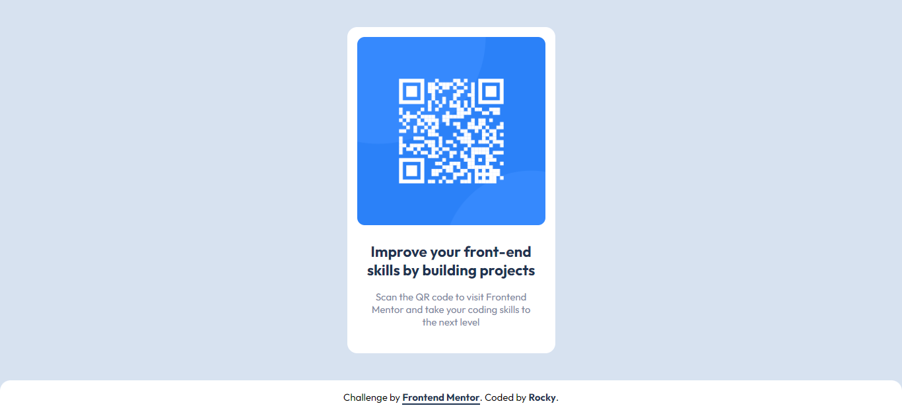

# Frontend Mentor - QR code component solution

This is a solution to the
[QR code component challenge on Frontend Mentor](https://www.frontendmentor.io/challenges/qr-code-component-iux_sIO_H).
Frontend Mentor challenges help you improve your coding skills by building
realistic projects.

## Table of contents

- [Overview](#overview)
  - [Screenshot](#screenshot)
  - [Links](#links)
- [My process](#my-process)
  - [Built with](#built-with)
  - [What I learned](#what-i-learned)
  - [Continued development](#continued-development)
  - [Useful resources](#useful-resources)
- [Author](#author)
- [Acknowledgments](#acknowledgments)

**Note: Delete this note and update the table of contents based on what sections
you keep.**

## Overview

### Screenshot

### Links

- Solution URL: [Add solution URL here](https://your-solution-url.com)
- Live Site URL: [Add live site URL here](https://your-live-site-url.com)

## My process

### Built with

- Semantic HTML5 markup
- CSS custom properties
- Flexbox
- BEM Methodology
- Mobile-first workflow

### What I learned

Working on this project helped me to practice BEM Methodology. I still feel a
little bit rusty on that, for sure need to work more on it.

Overall this is pretty basic project so there's no much to be learn, but it does
helps to reinforce and to put into practice what I've learned. Small and simple
projects like this helps to put into practice my knowledges and built-up
confidence in my skills!

What particularly I got to have in mind is to start from little things and then
build up from there, and then everything will sorta get in its position easier!
The key is to break down a complex problem into smaller ones.

### Continued development

- Definitely **BEM Methodology** is one of them!
- Got to lookup about types of components and their names.
- I should get use to use `em` units more often, to get comfy using them.
- Using GitHub.

## Author

- GitHub - [MalconH](https://github.com/MalconH)
- Frontend Mentor - [Malcon](https://www.frontendmentor.io/profile/MrRockRoll)
- LinkedIn - [Malcon Heltner](https://www.linkedin.com/in/malcon-heltner/)

<!-- ## Acknowledgments

This is where you can give a hat tip to anyone who helped you out on this
project. Perhaps you worked in a team or got some inspiration from someone
else's solution. This is the perfect place to give them some credit.
-->
